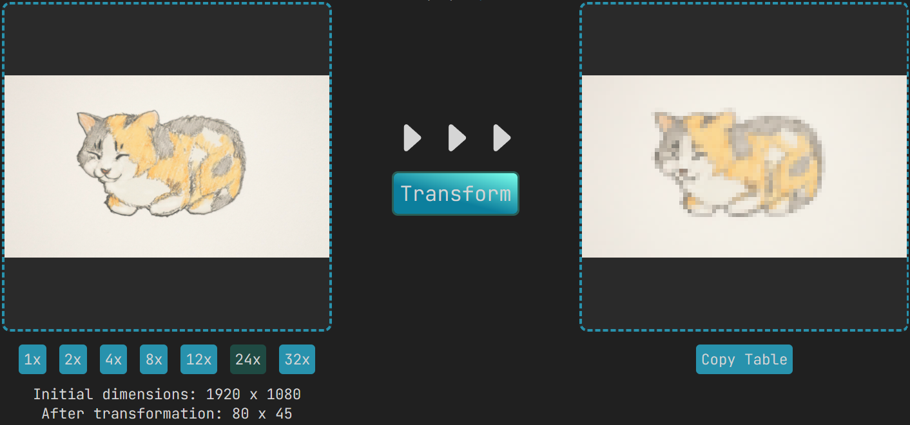

<!-- @format -->

# Taboolon

Website converting images to tables of various sizes that later can be inserted into Excel, Google Sheets or others!

## How to use

Simply choose an image (jpg, png), select the compression of the table and click "Transform". The result will be shown on the right and you can copy it to your clipboard by clicking "Copy Table"!

## Compression?

The compression is the number that scales down the image. So if you choose 1x you're going to get the original image as a table. For 2x it's going to have 4 times less pixels than the original, 4x is going to be 8 times less and so on.

## 🚨 Notice 🚨

It is recommended not to go above 400 x 400 pixels so choose the right compression! Otherwise it might lag while copying and inserting the table.
